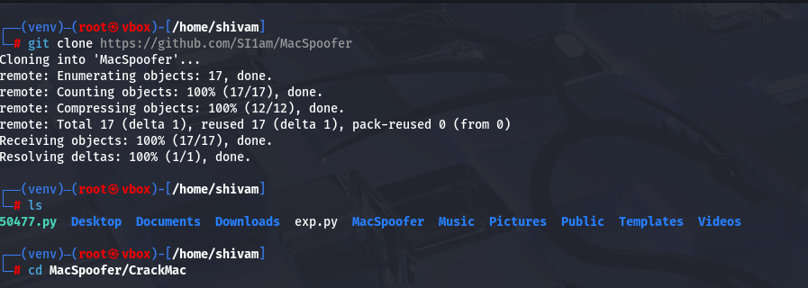
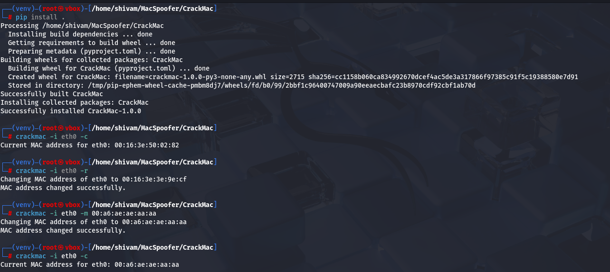

# CrackMac

**CrackMac** is a Python-based CLI tool to spoof MAC addresses on Linux. It helps with privacy, security research, and testing.

## 🔧 Installation

```bash
git clone https://github.com/SI1am/MacSpoofer
cd MacSpoofer/CrackMac
pip install .


🚀 Usage

Check current MAC:
crackmac -i wlan0 -c or
crackmac -i eth0 -c

Change to random MAC:
crackmac -i wlan0 -r or
crackmac -i wlan0 -r


Set specific MAC:
crackmac -i wlan0 -m 00:16:3e:50:02:82 or
crackmac -i eth0 -m 00:16:3e:50:02:82



